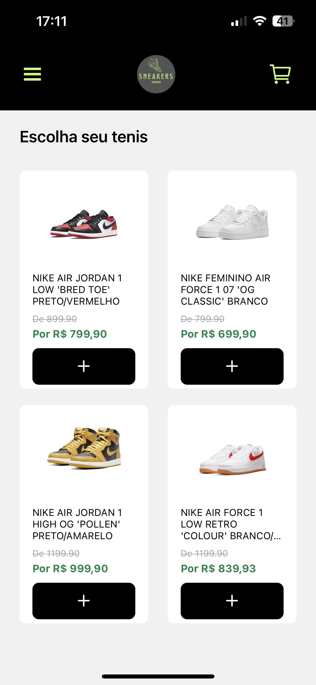
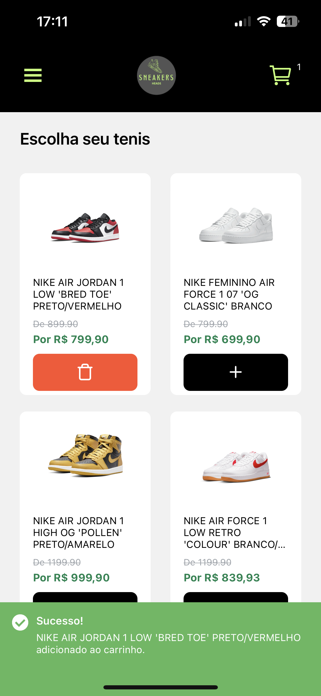
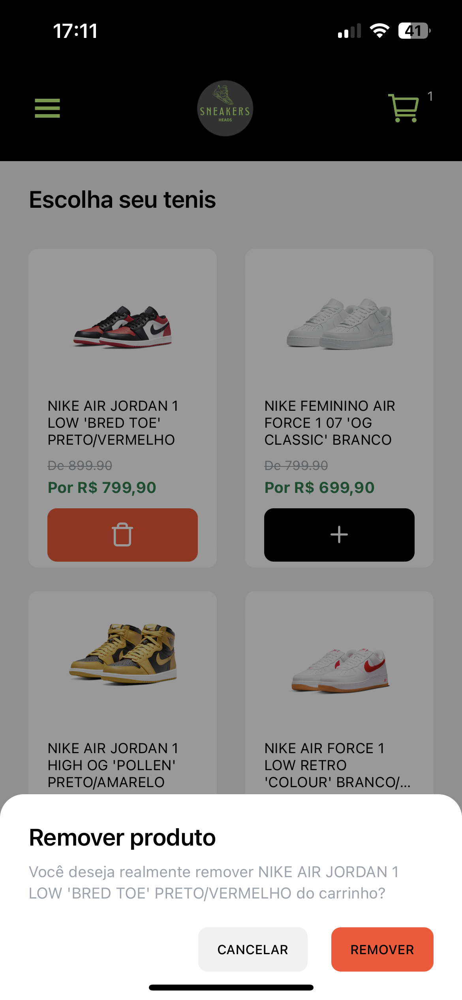
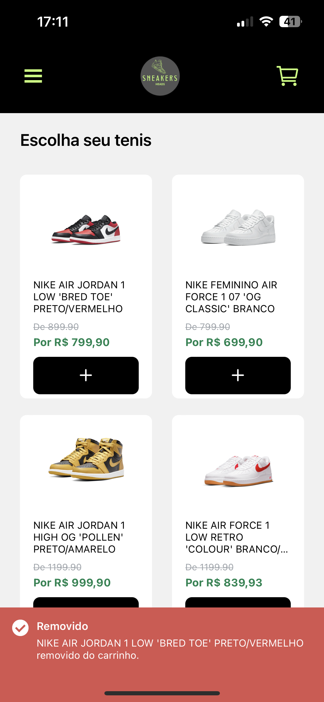
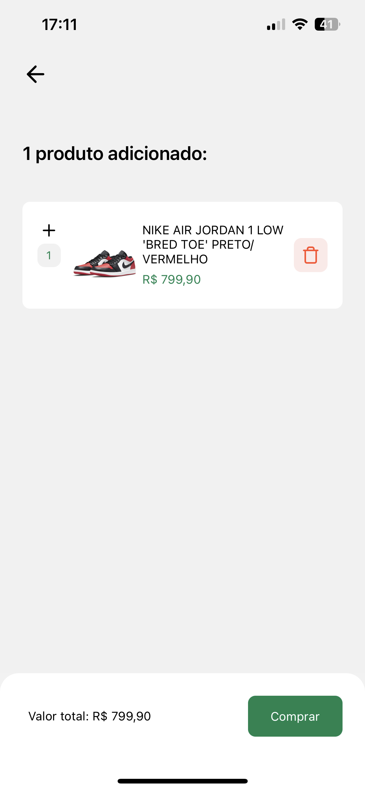
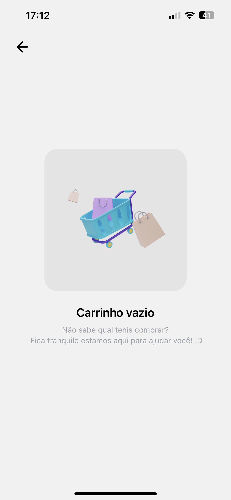

<h4 align="center">
    
</h4>

## Sobre

Este projeto foi desenvolvido para um **desafio técnico** para conhecimentos gerais de React Native.

Layout do projeto [Figma](https://www.figma.com/file/2MFqqfpgUWbwqBcsq5aLko/SNEAKERS-HEADS---SHOP?node-id=0%3A1&t=1cCWDlIfZo9Ler0r-1)

-------------

## Tecnologias Utilizadas

Esse projeto foi desenvolvido com as seguintes tecnologias:

- [Typescript](https://www.typescriptlang.org/)
- [React Native](https://reactnative.dev/)
- [Expo](https://expo.dev/)
- [Axios](https://axios-http.com/ptbr/docs/intro)
- [Styled Components](https://styled-components.com/)

-------------

## 📝 Pré-requisitos

Para rodar este projeto é necessário ter instalado na sua máquina as seguntes tecnologias:

- É necessário possuir o [Node.js](https://nodejs.org/en/) instalado na máquina.
- Também, é preciso ter um gerenciador de pacotes seja [Yarn](https://yarnpkg.com/) ou [NPM](https://www.npmjs.com/).
- Nesse projeto utilizei o [Expo](https://expo.dev/).

## Para rodar o projeto

1. Instale as dependências: `yarn`
2. Startar a aplicação: `yarn start`
3. Escolher o emulador da sua preferencia.

## 📷 Resultado

<h1 align="center">
     
     
     
     
     
     
     
</h1>
